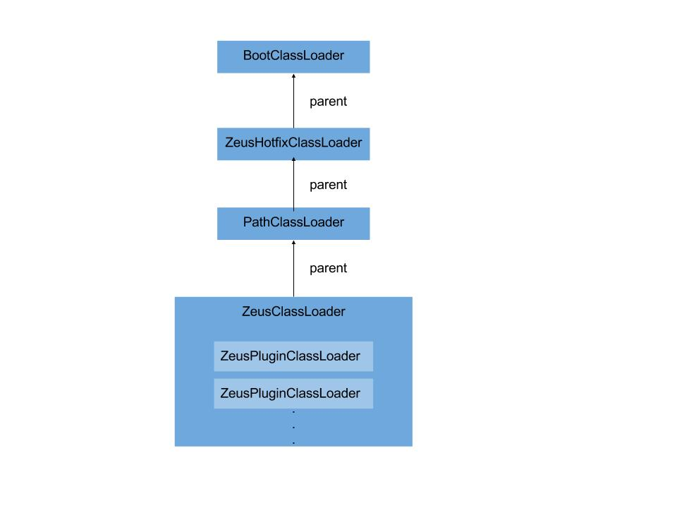

## 掌阅Android App插件补丁实践


### 遇到问题

* 65K方法数超限

  随着应用不断迭代，业务线的扩展,应用越来越大，那么很不幸，总有一天，当你编译的时候，会遇到一个类似下面的错误：

  ```java
  Conversion to Dalvik format failed: Unable to execute dex: method ID not in [0, 0xffff]: 65536
  ```

  没错，这就是臭名昭著的65536方法数超限问题。具体原理可以参考[由Android 65K方法数限制引发的思考](http://jayfeng.com/2016/03/10/%E7%94%B1Android-65K%E6%96%B9%E6%B3%95%E6%95%B0%E9%99%90%E5%88%B6%E5%BC%95%E5%8F%91%E7%9A%84%E6%80%9D%E8%80%83/)这篇文章。当然，google也意识到这个问题，所以发布了MultiDex支持库。喜大普奔，赶紧使用，问题解决？Too Young ! 使用过程中，你会发现MultiDex有不少坑：启动时间过长、ANR/Crash。当然也有解决方法，可以参考[美团自动拆包方案](http://tech.meituan.com/mt-android-auto-split-dex.html)。但我只想说真的太....麻烦了，还能不能愉快地回家玩游戏了....

* 上线太慢，更新率太低

  总所周知，Android APP发布流程较为漫长，一般需要经历`开发完成—上传市场—审核—上线`几个阶段，而且各个市场都各有各的政策和审核速度，每发一版都是一次煎熬呀。再者，Android APP的升级率跟Android系统升级率一样，怎一个慢字了得。新版本要覆盖80%左右，怎么也需要两周左右。

* 一上线就如临大敌

  以为应用上线就完事了？NO ！相信大部分开发同学在应用上线的头一周都是过得提心吊胆的，祈祷着不要出bug，用户不要反馈问题。但往往事与愿违，怎么办，赶紧出hotfix版本？

### 解决方案

就不卖关子了，是的，我们的解决方案是构建一套插件补丁的方案，期望可以无痛解决以上问题。插件化和补丁在目前看来是老生常谈的东西了，市面上已经有一堆实现方案，如[DroidPlugin](https://github.com/Qihoo360/DroidPlugin)、[Small](https://github.com/wequick/Small)、[Android-Plugin-Framework](https://github.com/limpoxe/Android-Plugin-Framework)。掌阅研究插件化是从2014年中开始，研究补丁是从2016年初开始，相对来说，算是比较晚。直至目前，插件化方案已经达到相对成熟的阶段，而补丁方案也已经上线。秉着开源的精神，我们的插件补丁方案最近已经在Github开源— [ZeusPlugin](https://github.com/iReaderAndroid/ZeusPlugin)。相对其他插件化和热修复方案，ZeusPlugin最大特点是：**简单易懂，核心类只有6个，类总数只有13个**，我们期望开发同学在使用这套方案的同时能理解所有的实现细节，在我们看来，这确实不是什么晦涩难懂的东西。

### 原理

要实现插件补丁，其实无非就是要解决几个问题：**插件安装、资源加载和类加载**。这几点，我们可以参考Android系统加载APK的实现原理。

#### Android系统加载APK	

* **APK安装过程**

  1. 复制APK安装包到data/app临时目录下，如`vmdl648417937.tmp/base.apk`；

  2. 解析应用程序的配置文件`AndroidManifest.xml`；

  3. 进行Dexopt并生成ODEX,如`vmdl648417937.tmp/oat/arm/base.odex`；

  4. 将临时目录(vmdl648417937.tmp)重命名为`packageName + "-" + suffix`,如`com.test_1`；

  5. 在PackageManagerService中将上述步骤生成的apk信息通过mPackages成员变量缓存起来；

     > mPackages是个ArrayMap，key为包名，value为[PackageParser.Package](https://android.googlesource.com/platform/frameworks/base/+/56a2301/core/java/android/content/pm/PackageParser.java)(apk包信息)

  6. 在data/data目录下创建对应的应用数据目录。

* **启动APK过程**

  1. 点击桌面App图标，Launcher接收到点击事件，获取应用信息，通过Binder IPC向SystemService进程(即system_process)发起startActivity请求(ActivityManagerService(AMS)#startActivity)；
  2. SystemServer(AMS) 向zygote进程请求启动一个新进程（ActivityManagerService#startProcessLocked）；
  3. Zygote进程fork出新的子进程(APP进程)，在新进程中执行 ActivityThread 类的 main 方法；
  4. App进程创建ActivityThread实例，并通过Binder IPC向 SystemServer(AMS) 请求 attach 到 AMS;
  5. SystemServer(AMS) 进程在收到请求后，进行一系列准备工作后，再通过binder IPC向App进程发送`bindApplication`和`scheduleLaunchActivity`请求；
  6. App进程(ActivityThread）在收到`bindApplication`请求后，通过handler向主线程发送`BIND_APPLICATION`消息；
  7. 主线程在收到`BIND_APPLICATION`消息后,根据传递过来的ApplicationInfo创建一个对应的LoadApk对象(标志当前APK信息),然后创建ContextImpl对象(标志当前进程的环境)，紧接着通过反射创建目标Application，并调用其attach方法，将ContextImpl对象设置为目标Application的上下文环境，最后调用Application的onCreate函数，做一些初始工作；
  8. App进程(ApplicationThread）在收到`scheduleLaunchActivity`请求后，通过handler向主线程发送`LAUNCH_ACTIVITY`消息；
  9. 主线程在收到`LAUNCH_ACTIVITY`消息后，通过反射机制创建目标Activity，并调用Activity的onCreate()方法。

以上分析都是基于Android 6.0的源码，其他版本可能有少许差异，但不影响主流程，限于篇幅问题，在此不一一展开分析，只重点分析相关的关键几个步骤。

为什么提到**Android系统加载APK**的流程，因为分析完**Android系统加载APK**的流程，插件补丁方案也就基本能实现出来了，下面我展开说一下。

####插件安装

从APK安装过程分析得知

1. **配置文件`AndroidManifest.xml`是在应用安装时就已经解析并记录，所以插件的AndroidManifest.xml配置无法生效**
2. **每个APK安装都是独享空间的，不同APK、同一个APK的不同时间安装都是完全独立的**。这样做，个人觉得大大降低了系统的复杂度，而且清晰明了。在这点上， [ZeusPlugin](https://github.com/iReaderAndroid/ZeusPlugin)插件安装策略几乎就是仿照系统设计的。具体可以参考 [ZeusPlugin](https://github.com/iReaderAndroid/ZeusPlugin)源码，在此不展开描述。

#### 类加载

   从上述启动APK过程分析7、9可以得知，Application和Activity都是通过反射机制创建的，我们可以看看Application创建具体源码实现：

   ActivityThread#handleBindApplication

```java
   private void handleBindApplication(AppBindData data) {
         	......
             //省略代码
   	    .......
             //生成APK信息LoadedApk，即packageInfo
           data.info = getPackageInfoNoCheck(data.appInfo, data.compatInfo);
      		 //创建上下文环境
           final ContextImpl appContext = ContextImpl.createAppContext(this, data.info);
    		......
             //省略代码
   	    .......
           try {
               // If the app is being launched for full backup or restore, bring it up in
               // a restricted environment with the base application class.
             	//通过反射机制创建Application实例
               Application app = data.info.makeApplication(data.restrictedBackupMode, null);
               mInitialApplication = app;

           	......
             	//省略代码
   	   		 .......

               try {
                  	//调用Application onCreate方法·
                   mInstrumentation.callApplicationOnCreate(app);
               } catch (Exception e) {
                   if (!mInstrumentation.onException(app, e)) {
                       throw new RuntimeException(
                           "Unable to create application " + app.getClass().getName()
+ ": " + e.toString(), e);
                         }
          }
      } finally {
          StrictMode.setThreadPolicy(savedPolicy);
      }
  }
```

  我们再看看`LoadedApk#makeApplication`的实现

```java
   public Application makeApplication(boolean forceDefaultAppClass,
              Instrumentation instrumentation) {
          if (mApplication != null) {
              return mApplication;
          }

          Application app = null;

          String appClass = mApplicationInfo.className;
          if (forceDefaultAppClass || (appClass == null)) {
              appClass = "android.app.Application";
          }

          try {
            	//获取ClassLoader
              java.lang.ClassLoader cl = getClassLoader();
              if (!mPackageName.equals("android")) {
                  initializeJavaContextClassLoader();
              }
              ContextImpl appContext = ContextImpl.createAppContext(mActivityThread, this);
              //使用获取到的ClassLoader通过反射机制创建Application实例，其内部实现是通过		ClassLoader.loadClass(className)得到Application Class
              app = mActivityThread.mInstrumentation.newApplication(
                      cl, appClass, appContext);
              appContext.setOuterContext(app);
          } catch (Exception e) {
              if (!mActivityThread.mInstrumentation.onException(app, e)) {
                  throw new RuntimeException(
                      "Unable to instantiate application " + appClass
                      + ": " + e.toString(), e);
              }
          }
          mActivityThread.mAllApplications.add(app);
          mApplication = app;

         ......
          //省略代码
  	   .......

          return app;
      }
```

  从上述代码可以得知，系统加载Application时候是先获取一个特定ClassLoader，然后该ClassLoader通过反射机制创建Application实例。我们继续看看getClassLoader()的实现

```java
  public ClassLoader getClassLoader() {
          synchronized (this) {
              if (mClassLoader != null) {
                  return mClassLoader;
              }

              if (mIncludeCode && !mPackageName.equals("android")) {
                  ......
         		 //省略代码
  	 		  .......
  			   //创建ClassLoader
                  mClassLoader = ApplicationLoaders.getDefault().getClassLoader(zip, lib,
                          mBaseClassLoader);

                  StrictMode.setThreadPolicy(oldPolicy);
              } else {
                  if (mBaseClassLoader == null) {
                      mClassLoader = ClassLoader.getSystemClassLoader();
                  } else {
                      mClassLoader = mBaseClassLoader;
                  }
              }
              return mClassLoader;
          }
      }
```

  继续跟踪ApplicationLoaders类

```java

      public ClassLoader getClassLoader(String zip, String libPath, ClassLoader parent)
      {
        
          ClassLoader baseParent = ClassLoader.getSystemClassLoader().getParent();

          synchronized (mLoaders) {
              if (parent == null) {
                  parent = baseParent;
              }

              /*
               * If we're one step up from the base class loader, find
               * something in our cache.  Otherwise, we create a whole
               * new ClassLoader for the zip archive.
               */
              if (parent == baseParent) {
                  ClassLoader loader = mLoaders.get(zip);
                  if (loader != null) {
                      return loader;
                  }
      
                  Trace.traceBegin(Trace.TRACE_TAG_ACTIVITY_MANAGER, zip);
                
                  PathClassLoader pathClassloader =
                      new PathClassLoader(zip, libPath, parent);
                  Trace.traceEnd(Trace.TRACE_TAG_ACTIVITY_MANAGER);
  		
                  mLoaders.put(zip, pathClassloader);
                  return pathClassloader;
              }

              Trace.traceBegin(Trace.TRACE_TAG_ACTIVITY_MANAGER, zip);
              PathClassLoader pathClassloader = new PathClassLoader(zip, parent);
              Trace.traceEnd(Trace.TRACE_TAG_ACTIVITY_MANAGER);
              return pathClassloader;
          }
      }

```

 ApplicationLoaders是一个静态缓存工具类，其内部维护了一个key为dexPath，value为PathClassLoader的ArrayMap，可以看到，应用程序使用的ClassLoader都是同一个PathClassLoader类的实例

 我们继续扒一扒PathClassLoader的源码，发现其实现都在父类[BaseDexClassLoader](https://android.googlesource.com/platform/libcore-snapshot/+/ics-mr1/dalvik/src/main/java/dalvik/system/BaseDexClassLoader.java)中，我们直接找到其`findClass`方法

```java
  protected Class<?> findClass(String name) throws ClassNotFoundException {
          List<Throwable> suppressedExceptions = new ArrayList<Throwable>();
          Class c = pathList.findClass(name, suppressedExceptions);
          if (c == null) {
              ClassNotFoundException cnfe = new ClassNotFoundException("Didn't find class \"" + name + "\" on path: " + pathList);
              for (Throwable t : suppressedExceptions) {
                  cnfe.addSuppressed(t);
              }
              throw cnfe;
          }
          return c;
      }

```

  可以看到，查找Class的任务通其内部一个`DexPathList`类对象实现的，它的`findClass`方法如下：

```java
   public Class findClass(String name, List<Throwable> suppressed) {
          for (Element element : dexElements) {
              DexFile dex = element.dexFile;

              if (dex != null) {
                  Class clazz = dex.loadClassBinaryName(name, definingContext, suppressed);
                  if (clazz != null) {
                      return clazz;
                  }
              }
          }
          if (dexElementsSuppressedExceptions != null) {
              suppressed.addAll(Arrays.asList(dexElementsSuppressedExceptions));
          }
          return null;
      }
```

至此，真相大白，原来，APK类加载是通过遍历`dexElements`这个数组来查找Class，而dexElements就是APK dexPath里面的文件。

从上述分析可以得知要实现插件的类加载有两种方式：

1. **把插件的信息通过反射放进这个数组里面**
2. **替换系统的ClassLoader**

 考虑到类的隔离性以及框架拓展性，[ZeusPlugin](https://github.com/iReaderAndroid/ZeusPlugin)目前使用的方案是第二种，根据类加载器的双亲委派模型，我们可以实现一套插件补丁类加载方案，如下图：

 

>  1. 我们通过反射修改系统的ClassLoader为ZeusClassLoader，其内包含多个ZeusPluginClassLoader
>  2. 每一个插件对应一个ZeusPluginClassLoader，当移除插件时则删除一个ZeusPluginClassLoader，加载一个插件则添加一个ZeusPluginClassLoader，
>  3. ZeusClassLoader的parent为原始APK的ClassLoader(PathClassLoader)，而原始APK的ClassLoader的parent(PathClassLoader)为ZeusHotfixClassLoader, ZeusHotfixClassLoader的parent为系统的ClassLoader(BootClassLoader)。

#### 资源加载

  关于资源加载，我们回到`handleBindApplication`方法

```java
  private void handleBindApplication(AppBindData data) {
        	......
            //省略代码
  	    .......
            //生成APK信息LoadedApk，即packageInfo
          data.info = getPackageInfoNoCheck(data.appInfo, data.compatInfo);
     		 //创建上下文环境
          final ContextImpl appContext = ContextImpl.createAppContext(this, data.info);
   		......
            //省略代码
  	    .......
    }
```

 这里创建了上下文环境，即ContextImpl，再看看createAppContext方法真正实现：

```java
  private ContextImpl(ContextImpl container, ActivityThread mainThread,
              LoadedApk packageInfo, IBinder activityToken, UserHandle user, boolean restricted,
              Display display, Configuration overrideConfiguration, int createDisplayWithId) {
          ......
            //省略代码
  	    .......
  		//真正创建Resources的地方
          Resources resources = packageInfo.getResources(mainThread);
          if (resources != null) {
              if (displayId != Display.DEFAULT_DISPLAY
                      || overrideConfiguration != null
                      || (compatInfo != null && compatInfo.applicationScale
                              != resources.getCompatibilityInfo().applicationScale)) {
                  resources = mResourcesManager.getTopLevelResources(packageInfo.getResDir(),
                          packageInfo.getSplitResDirs(), packageInfo.getOverlayDirs(),
                          packageInfo.getApplicationInfo().sharedLibraryFiles, displayId,
                          overrideConfiguration, compatInfo);
              }
          }
          mResources = resources;
  		......
            //省略代码
  	    .......
       
      }
```

 `Resources resources = packageInfo.getResources(mainThread);`这段代码就是真正创建Resources的地方，我们继续跟进去会发现它最终调用的是ResourcesManager的getTopLevelResources方法

```java
   Resources getTopLevelResources(String resDir, String[] splitResDirs,
              String[] overlayDirs, String[] libDirs, int displayId,
              Configuration overrideConfiguration, CompatibilityInfo compatInfo) {
          final float scale = compatInfo.applicationScale;
          Configuration overrideConfigCopy = (overrideConfiguration != null)
                  ? new Configuration(overrideConfiguration) : null;
          ResourcesKey key = new ResourcesKey(resDir, displayId, overrideConfigCopy, scale);
          Resources r;
          synchronized (this) {
              // Resources is app scale dependent.
              if (DEBUG) Slog.w(TAG, "getTopLevelResources: " + resDir + " / " + scale);
  		   //判断是否已经存在Resources
              WeakReference<Resources> wr = mActiveResources.get(key);
              r = wr != null ? wr.get() : null;
              //if (r != null) Log.i(TAG, "isUpToDate " + resDir + ": " + r.getAssets().isUpToDate());
              if (r != null && r.getAssets().isUpToDate()) {
                  if (DEBUG) Slog.w(TAG, "Returning cached resources " + r + " " + resDir
                          + ": appScale=" + r.getCompatibilityInfo().applicationScale
                          + " key=" + key + " overrideConfig=" + overrideConfiguration);
                  return r;
              }
          }

          //if (r != null) {
          //    Log.w(TAG, "Throwing away out-of-date resources!!!! "
          //            + r + " " + resDir);
          //}
  		//创建资源管理器
          AssetManager assets = new AssetManager();
          // resDir can be null if the 'android' package is creating a new Resources object.
          // This is fine, since each AssetManager automatically loads the 'android' package
          // already.
          if (resDir != null) {
             //添加APK资源路径
              if (assets.addAssetPath(resDir) == 0) {
                  return null;
              }
          }
  	    ......
            //省略代码
  	    .......
          //创建Resources
          r = new Resources(assets, dm, config, compatInfo);
          if (DEBUG) Slog.i(TAG, "Created app resources " + resDir + " " + r + ": "
                  + r.getConfiguration() + " appScale=" + r.getCompatibilityInfo().applicationScale);

          synchronized (this) {
              WeakReference<Resources> wr = mActiveResources.get(key);
              Resources existing = wr != null ? wr.get() : null;
              if (existing != null && existing.getAssets().isUpToDate()) {
                  // Someone else already created the resources while we were
                  // unlocked; go ahead and use theirs.
                  r.getAssets().close();
                  return existing;
              }

              // XXX need to remove entries when weak references go away
              mActiveResources.put(key, new WeakReference<>(r));
              if (DEBUG) Slog.v(TAG, "mActiveResources.size()=" + mActiveResources.size());
              return r;
          }
      }

```

 至此，Resources就创建好了，这里有一个关键的类AssetManager，它是应用程序的资源管理器，在它的构造函数里会把`framework/framework-res.apk`也会添加到资源路径中，这是C++调用，有兴趣的话，可以参考一下老罗[这篇文章](http://blog.csdn.net/luoshengyang/article/details/8791064)。同时这也解释了为什么我们开发的应用可以访问到系统的资源。

 通过上述分析，我们可以得知，要实现插件资源加载，只需**创建一个`AssetManager`,然后把把宿主资源路径和插件apk路径添加进去，创建我们自己的Resources，然后通过反射把PackageInfo的`mResources`替换成我们的Resources**即可，具体代码如下：

```java
   AssetManager assetManager = AssetManager.class.newInstance();
              Method addAssetPath = AssetManager.class.getMethod("addAssetPath", String.class);
              addAssetPath.invoke(assetManager, mBaseContext.getPackageResourcePath());
              if (mLoadedPluginList != null && mLoadedPluginList.size() != 0) {
                  //每个插件的packageID都不能一样
                  for (String id : mLoadedPluginList.keySet()) {
                      addAssetPath.invoke(assetManager, PluginUtil.getAPKPath(id));
                  }
              }
              //这里提前创建一个resource是因为Resources的构造函数会对AssetManager进行一些变量的初始化
              //还不能创建系统的Resources类，否则中兴系统会出现崩溃问题
              PluginResources newResources = new PluginResources(assetManager,
                      mBaseContext.getResources().getDisplayMetrics(),
                      mBaseContext.getResources().getConfiguration());


              PluginUtil.setField(mBaseContext, "mResources", newResources);
              //这是最主要的需要替换的，如果不支持插件运行时更新，只留这一个就可以了
              PluginUtil.setField(mPackageInfo, "mResources", newResources);
```

现在，参考以上思路，我们已经基本可以实现一个插件补丁框架，其实站在巨人的肩膀(Android 系统源码)上，是不是觉得实现一套插件补丁框架也没那么复杂呢？当然，真正项目中，还有很多细节需要处理，譬如说资源分区、代码混淆等问题。但核心逻辑基本还是以上这些思路。具体实现可以参考 [ZeusPlugin](https://github.com/iReaderAndroid/ZeusPlugin)源码

### TODO

由于公司业务线、时间精力等原因， [ZeusPlugin](https://github.com/iReaderAndroid/ZeusPlugin)有一些特性和功能还没实现，但很多也提上日程了，比如：

* demo完善

* gradle插件maven远程依赖

* 支持补丁更换资源

  ……..

### GitHub

https://github.com/iReaderAndroid/ZeusPlugin

### 我的微信公众号：AndroidExplore


 


